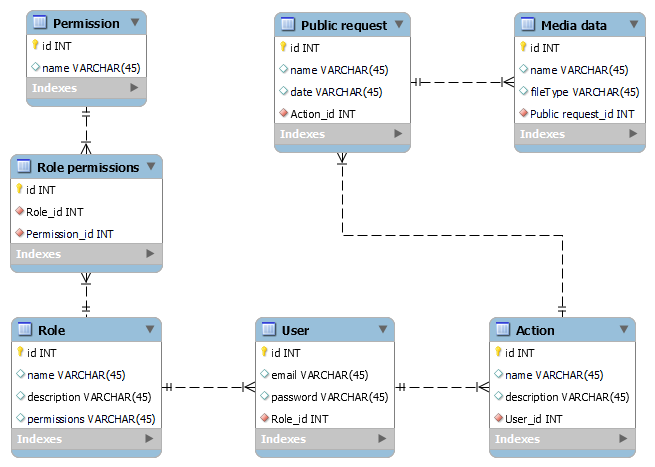

# Проєктування бази даних

## Модель бізнес-об'єктів

@startuml

entity User #800000
entity User.id #808080
entity User.email #808080
entity User.password #808080
entity User.roleId #808080

User.id -up-* User 
User.email -up-* User 
User.password -up-* User 
User.roleId -up-* User

entity Role #800000
entity Role.id #808080
entity Role.name #808080
entity Role.description #808080

Role.id -up-* Role 
Role.name -up-* Role 
Role.description -up-* Role

entity RolePermissions #D2691E
entity RolePermissions.permisionId #808080
entity RolePermissions.roleName #808080

RolePermissions.permisionId --* RolePermissions 
RolePermissions.roleName --* RolePermissions

entity Permision #D2691E
entity Permision.id #808080
entity Permision.name #808080

Permision.id --* Permision 
Permision.name --* Permision

entity PubRequest #D2691E
entity PubRequest.name #808080
entity PubRequest.date #808080

PubRequest.name --* PubRequest 
PubRequest.date --* PubRequest

entity MediaData #D2691E
entity MediaData.id #808080
entity MediaData.name #808080
entity MediaData.fileType #808080

MediaData.id --* MediaData 
MediaData.name --* MediaData 
MediaData.fileType --* MediaData

entity Action #800000
entity Action.id #808080
entity Action.name #808080
entity Action.description #808080

Action.id --* Action 
Action.name --* Action 
Action.description --* Action

entity Guest #F0FFFF
entity RegisteredUser #F0FFFF
entity Admin#F0FFFF

entity AccountManage #F0FFFF
entity DataManage #F0FFFF
entity SearchManage #F0FFFF
entity SupportManage #F0FFFF

Guest ..> Role :instanceOf 
RegisteredUser ..> Role :instanceOf 
Admin ..> Role :instanceOf

AccountManage .up.> Action :instanceOf 
DataManage .up.> Action :instanceOf 
SearchManage .up.> Action :instanceOf 
SupportManage .up.> Action :instanceOf

Permision "1.1" -- "0.*" RolePermissions 
RolePermissions "0.*" -- "1.1" Role 
Role "1.1" -right- "0.*" User
MediaData "0.*" -- "1.1" PubRequest 
PubRequest "0.*" -- "1.1" Action
Action "0.*" -- "1.1" User

@enduml

## ER-модель

@startuml

namespace UserManagement {
  entity User {
    id : Int
    email : Text
    password : Text
    roleId : Int
  }
  
  entity Action {
    id : Int
    name : Text
    description : Text
  }

  object AccountManage
  object DataManage
  object SearchManage
  object SupportManage
}

namespace AccesControl {
  entity Role {
    id : Int
    name : Text
    description : Text
  }
  
  entity "Role permissions" as RolePermissions {
    permisionId : Int
    roleName : Text
  }
  
  entity Permision {
    id : Int
    name : Text
  }
  
  object Guest
  object RegisteredUser
  object Admin
}

namespace MediaManagement {
  entity "Public request" as PubRequest {
    name : Text
    date : Text
  }
  
  entity "Media data" as MediaData {
    id : Int
    name : Text
    fileType: Text
  }
}

Guest .up.> Role
RegisteredUser .up.> Role
Admin .up.> Role

AccountManage .up.> Action
DataManage .up.> Action
SearchManage .up.> Action
SupportManage .up.> Action

Permision "1.1" -- "0.*" RolePermissions
RolePermissions "0.*" -- "1.1" Role
Role "1.1" -- "0.*" User
MediaData "0.*" -- "1.1" PubRequest
PubRequest "0.*" -- "1.1" Action
Action "0.*" -- "1.1" User

@enduml

## Реляційна схема

